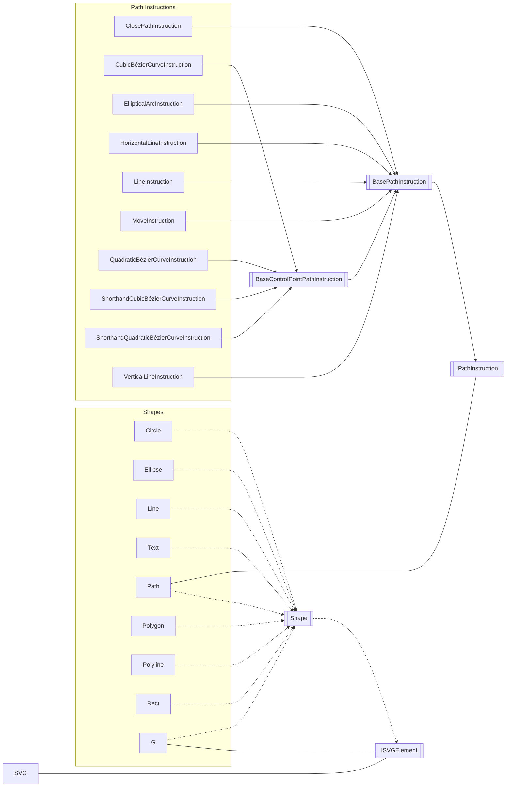

# KristofferStrube.Blazor.SVGEditor
[](/LICENSE)
[](https://github.com/KristofferStrube/Blazor.SVGEditor/issues)
[](https://github.com/KristofferStrube/Blazor.SVGEditor/network/members)
[](https://github.com/KristofferStrube/Blazor.SVGEditor/stargazers)
[](https://www.nuget.org/packages/KristofferStrube.Blazor.SVGEditor/)

A basic HTML SVG Editor written in Blazor WASM.


# Demo
The WASM sample project can be demoed at [https://kristofferstrube.github.io/Blazor.SVGEditor/](https://kristofferstrube.github.io/Blazor.SVGEditor/)

# Getting Started
## Prerequisites
You need to install .NET 7.0 or newer to use the library.

[Download .NET 7](https://dotnet.microsoft.com/download/dotnet/7.0)

## Installation
You can install the package via NuGet with the Package Manager in your IDE or alternatively using the command line:
```bash
dotnet add package KristofferStrube.Blazor.SVGEditor
```
The package can be used in Blazor WebAssembly and Blazor Server projects. In the samples folder of this repository, you can find two projects that show how to use the `SVGEditor` component in both Blazor Server and WASM.

## Import
You need to reference the package to use it in your pages. This can be done in `_Import.razor` by adding the following.
```razor
@using KristofferStrube.Blazor.SVGEditor
```

## Add to service collection
To use the component in your pages you also need to register som services in your service collection. We have made a single method that allows you to add the needed service which you use like so:

```csharp
var builder = WebAssemblyHostBuilder.CreateDefault(args);
builder.RootComponents.Add<App>("#app");
builder.RootComponents.Add<HeadOutlet>("head::after");

builder.Services.AddScoped(sp => new HttpClient { BaseAddress = new Uri(builder.HostEnvironment.BaseAddress) });

// Adding the needed services.
builder.Services.AddSVGEditor();

await builder.Build().RunAsync();
```

## Include needed stylesheets and scripts
The libraries that the component use also needs to have some stylesheets and scripts added to function.
For this you need to insert the follow tags in the `<head>` section of your `index.html` or `Host.cshtml` file:
```html
<link href="_content/BlazorColorPicker/colorpicker.css" rel="stylesheet" />
<link href="_content/Blazor.ContextMenu/blazorContextMenu.min.css" rel="stylesheet" />
<link href="_content/KristofferStrube.Blazor.SVGEditor/kristofferStrubeBlazorSVGEditor.css" rel="stylesheet" />
```
And to add this in the end of the same file after your have referenced Blazor Server og Wasm bootstraper:

```html
<script src="_content/BlazorColorPicker/colorpicker.js"></script>
<script src="_content/Blazor.ContextMenu/blazorContextMenu.min.js"></script>
```

## Adding the component to a site.
Now you are ready to use the component in your page. A minimal example of this would be the following:

```razor
<div style="height:80vh">
    <SVGEditor Input=@Input InputUpdated="(string s) => { Input = s; StateHasChanged(); }" />
</div>

@code {
    private string Input = @"<rect x=""0"" y=""0"" height=""200"" width=""200"" fill=""green"" stroke=""blue"" stroke-width=""2""></rect>";
}
```

# Tag type support and attributes
- RECT (x, y, width, height, fill, stroke, stroke-width, stroke-linecap, stroke-linejoin, stroke-offset)
- CIRCLE (cx, cy, r, fill, stroke, stroke-width, stroke-linecap, stroke-linejoin, stroke-offset)
- ELLIPSE (cx, cy, rx, ry, fill, stroke, stroke-width, stroke-linecap, stroke-linejoin, stroke-offset)
- POLYGON (points, fill, stroke, stroke-width, stroke-linecap, stroke-linejoin, stroke-offset)
- POLYLINE (points, fill, stroke, stroke-width, stroke-linecap, stroke-linejoin, stroke-offset)
- LINE (x1, y1, x2, y2, fill, stroke, stroke-width, stroke-linecap, stroke-linejoin, stroke-offset)
- TEXT (x, y, style:(font-size,font-weight,font-family), fill, stroke, stroke-width, stroke-linecap, stroke-linejoin, stroke-offset)
- PATH (d, fill, stroke, stroke-width, stroke-linecap, stroke-linejoin, stroke-offset)
    - Movements
    - Lines
    - Vertical Lines
    - Horizontal Lines
    - Close Path
    - Cubic Bézier Curve
        - Shorthand aswell
    - Quadratic Bézier Curve
        - Shorthand aswell
    - Elliptical Arc Curve
        - Needs more work for radi interaction
- G (fill, stroke, stroke-width, stroke-linecap, stroke-linejoin, stroke-offset)
    - Missing scaling of children
- ANIMATE
    - Support for showing all Animate tags when Playing
    - Support for editing Fill animation values
    - Support for editing Stroke animation values
    - Support for editing Stroke Offset values
- LINEARGRADIENT (x1, x2, y1, y2, and stops)

# Current goals
- Add support for touch devices
- Support errors better to recover instead of crashing when parsing malformed SVGs.

# Issues
Feel free to open issues on the repository if you find any errors with the package or have wishes for features.

# Diagram of relation between core types in the project.


