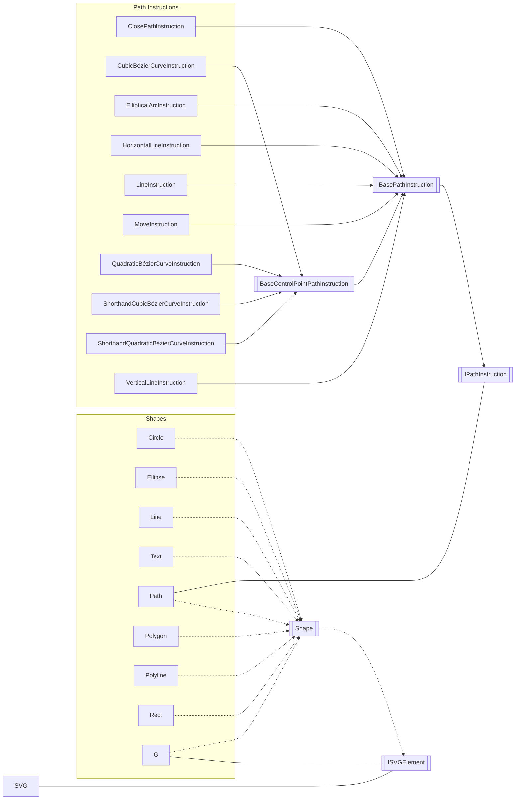

# KristofferStrube.Blazor.SVGEditor

A basic HTML SVG Editor written in Blazor WASM.

## Demo
The project can be demoed at [https://kristofferstrube.github.io/Blazor.SVGEditor/](https://kristofferstrube.github.io/Blazor.SVGEditor/)

## Tag type support and attributes
- RECT (x, y, width, height, fill, stroke, stroke-width, stroke-linecap, stroke-linejoin, stroke-offset)
- CIRCLE (cx, cy, r, fill, stroke, stroke-width, stroke-linecap, stroke-linejoin, stroke-offset)
- ELLIPSE (cx, cy, rx, ry, fill, stroke, stroke-width, stroke-linecap, stroke-linejoin, stroke-offset)
- POLYGON (points, fill, stroke, stroke-width, stroke-linecap, stroke-linejoin, stroke-offset)
- POLYLINE (points, fill, stroke, stroke-width, stroke-linecap, stroke-linejoin, stroke-offset)
- LINE (x1, y1, x2, y2, fill, stroke, stroke-width, stroke-linecap, stroke-linejoin, stroke-offset)
- TEXT (x, y, style:(font-size,font-weight,font-family), fill, stroke, stroke-width, stroke-linecap, stroke-linejoin, stroke-offset)
- PATH (d, fill, stroke, stroke-width, stroke-linecap, stroke-linejoin, stroke-offset)
    - Movements
    - Lines
    - Vertical Lines
    - Horizontal Lines
    - Close Path
    - Cubic Bézier Curve
        - Shorthand aswell
    - Quadratic Bézier Curve
        - Shorthand aswell
    - Elliptical Arc Curve
        - Needs more work for radi interaction
- G (fill, stroke, stroke-width, stroke-linecap, stroke-linejoin, stroke-offset)
    - Missing scaling of children
- ANIMATE
    - Support for showing all Animate tags when Playing
    - Support for editing Fill animation values
    - Support for editing Stroke animation values
    - Support for editing Stroke Offset values
- LINEARGRADIENT (x1, x2, y1, y2, and stops)

## Current goals
- Add support for touch devices
- Support errors better to recover instead of crashing on malformed SVG

